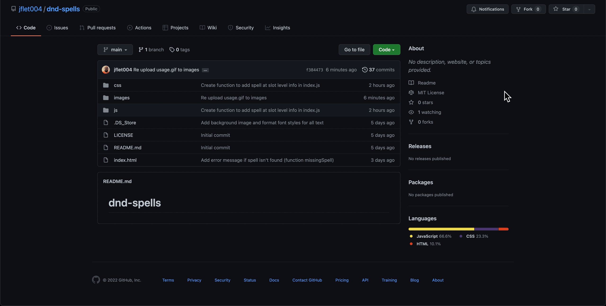

# SpellBinder

## Description

SpellBinder, a [Dungeons and Dragons](https://dnd.wizards.com/) 5e Spell Organizer is a Single Page Application that accesses data from a [public API](https://www.dnd5eapi.co/) and organizes however many spells you need on your screen. I've been playing Dungeons and Dragons for the past 2-3 years and one of the things I struggle with is keeping up with how many, and which spells my character has available at all times; specially during combat situations. This application helps you keep only the spells you need at hand and ready to go, keeping the flow of the game going without interruptions.

## Installation

To install, just fork this [repository](https://github.com/jflet004/dnd-spells).



Once you copy the HTTPS link, head over to the terminal and clone it.

```bash
git clone https://github.com/jflet004/dnd-spells.git
```

When thats done, make sure you `cd` into the correct folder.

```bash
cd dnd-spells
```

## Usage

You can open the application by typing `open index.html`(for macs) or `explorer.exe index.html` (for windows) in your terminal. Start by typing in the name of the spell you want information on. You can add as many spells as you want. Once you are done with them, you can remove them by clicking on the top right "X". Enjoy!


## Contributing

Pull requests are welcome. For major changes, please open an issue first to discuss what you would like to change.

Please make sure to update tests as appropriate.

## Acknowledgment

Thank you to the creators and its contributors for making this [D&D 5e](https://www.dnd5eapi.co/) public API!!

## License

[MIT](https://choosealicense.com/licenses/mit/)
